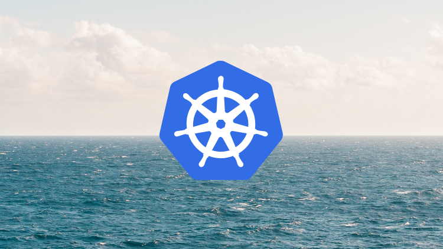
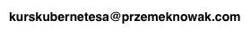

# [Kubernetes od podstaw - dla programistów i nie tylko](https://www.udemy.com/course/kubernetes-od-podstaw-dla-programistow-i-nie-tylko/?referralCode=4AB1DB66CD8879CF5F4B)

> Wersja 2025

Hej,

materiały tutaj zawarte dotyczą kursu ["Kubernetes od podstaw - dla programistów i nie tylko dostępnego na Udemy"](https://www.udemy.com/course/kubernetes-od-podstaw-dla-programistow-i-nie-tylko/?referralCode=).

W razie zainteresowania kursem zapraszam na stronę Udemy lub kontakt pod adresem:

Jeżeli zakupiłeś kurs lub korzystałeś z materiałów zachęcam do kliknięcia na [⭐ Star] 😉
